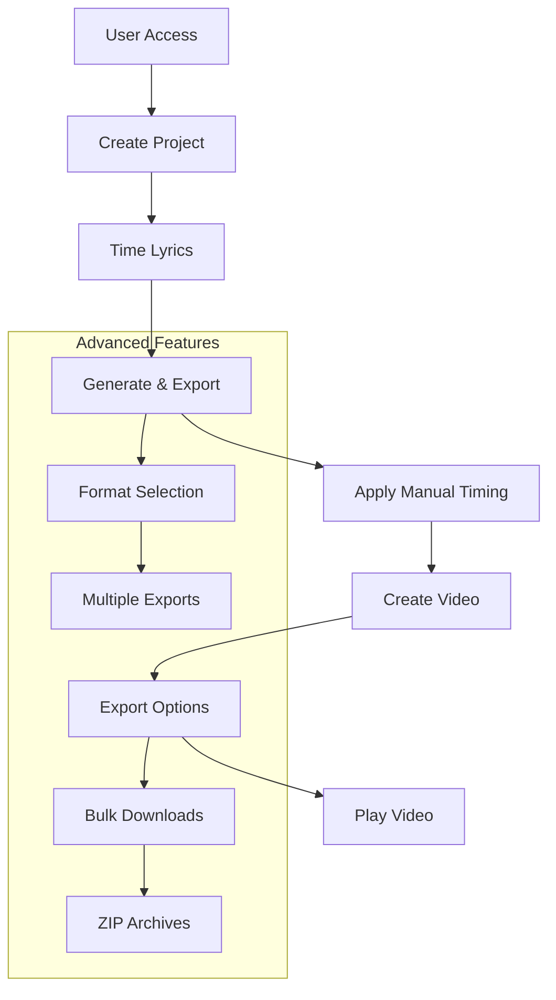
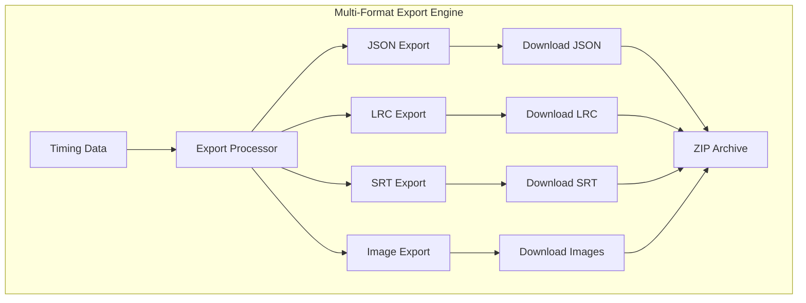
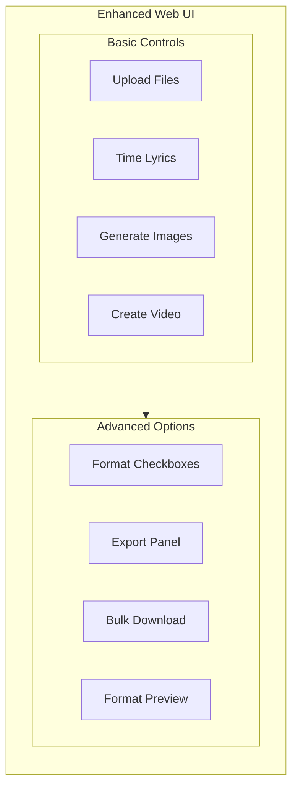

# 🚀 Advanced Features - Detailed Implementation

## Enhanced Web UI with Multiple Export Formats

### Advanced Workflow Overview



### Multi-Format Export System



### Enhanced User Interface



## Implementation Details

### Frontend Enhancements

#### **Format Selection Interface**
```html
<!-- Enhanced Step 3: Generate Images & Exports -->
<div class="format-selection">
    <h3>Select Export Formats:</h3>
    <label><input type="checkbox" checked> Images (PNG)</label>
    <label><input type="checkbox" checked> Karaoke format (LRC)</label>
    <label><input type="checkbox" checked> Subtitle format (SRT)</label>
    <label><input type="checkbox" checked> Data format (JSON)</label>
    <button id="generate-all">Generate All Formats</button>
</div>
```

#### **Download Management**
```html
<!-- Enhanced Step 6: Export Options -->
<div class="export-panel">
    <h3>Download Options:</h3>
    <div class="download-links">
        <a href="/api/download/project/lyrics.lrc">📄 LRC File</a>
        <a href="/api/download/project/lyrics.srt">🎬 SRT File</a>
        <a href="/api/download/project/timestamps.json">📊 JSON Data</a>
        <a href="/api/download-all/project">📦 Download All (ZIP)</a>
    </div>
</div>
```

### Backend API Extensions

#### **Enhanced Image Generation Endpoint**
```javascript
// POST /api/generate-formats
app.post('/api/generate-formats', async (req, res) => {
    const { projectName, formats } = req.body;
    
    // Construct command with format parameter
    const formatParam = formats.includes('all') ? 'all' : formats.join(',');
    const args = [
        'start', '--',
        audioPath, lyricsPath,
        '--output', outputPath,
        '--format', formatParam
    ];
    
    const process = spawn('npm', args, {
        cwd: path.join(__dirname, '..')
    });
    
    // Stream progress and handle completion
    process.stdout.on('data', (data) => {
        res.write(data.toString());
    });
    
    process.on('close', (code) => {
        if (code === 0) {
            res.write('\n✅ All formats generated successfully!\n');
            res.write('📁 Download links available below\n');
        }
    });
});
```

#### **Download Endpoints**
```javascript
// GET /api/download/:projectName/:format
app.get('/api/download/:projectName/:format', async (req, res) => {
    const { projectName, format } = req.params;
    const projectPath = path.join(PROJECTS_DIR, projectName);
    
    let filePath;
    switch (format) {
        case 'lrc':
            filePath = path.join(projectPath, 'lyrics.lrc');
            break;
        case 'srt':
            filePath = path.join(projectPath, 'lyrics.srt');
            break;
        case 'json':
            filePath = path.join(projectPath, 'output/timestamps.json');
            break;
    }
    
    if (fs.existsSync(filePath)) {
        res.download(filePath);
    } else {
        res.status(404).json({ error: 'File not found' });
    }
});

// GET /api/download-all/:projectName
app.get('/api/download-all/:projectName', async (req, res) => {
    const { projectName } = req.params;
    const projectPath = path.join(PROJECTS_DIR, projectName);
    
    // Create ZIP archive with all export files
    const zipPath = path.join(projectPath, 'exports.zip');
    const zip = new AdmZip();
    
    // Add all export files to ZIP
    zip.addLocalFile(path.join(projectPath, 'lyrics.lrc'));
    zip.addLocalFile(path.join(projectPath, 'lyrics.srt'));
    zip.addLocalFolder(path.join(projectPath, 'output'), 'images');
    
    zip.writeZip(zipPath);
    res.download(zipPath);
});
```

### Advanced Features Matrix

| Feature | Current Status | Enhanced Version | User Benefit |
|---------|----------------|------------------|--------------|
| **Format Selection** | JSON only | LRC, SRT, JSON, Images | Multi-platform compatibility |
| **Download Management** | Video only | Individual files + ZIP | Flexible export options |
| **Batch Operations** | Single project | Multiple projects | Bulk processing |
| **Format Preview** | None | In-browser preview | Quality verification |
| **Export History** | None | Previous exports | Re-download capability |

### Use Case Scenarios

#### **Karaoke Venue Operator**
```bash
Workflow:
1. Upload song + lyrics
2. Time lyrics with precision
3. Generate: Images + LRC + Video
4. Download LRC for karaoke system
5. Use video for promotional displays

Benefits:
- Professional karaoke compatibility
- Multiple venue formats
- Quick turnaround time
```

#### **YouTube Content Creator**
```bash
Workflow:
1. Create lyric video
2. Export SRT subtitles
3. Upload video + subtitles
4. Reach global audience
5. Improve accessibility

Benefits:
- Automatic subtitle generation
- Multi-language support
- SEO optimization
```

#### **Music Education Platform**
```bash
Workflow:
1. Process educational songs
2. Export JSON + LRC + Images
3. Integrate into web application
4. Interactive learning tools
5. Student engagement

Benefits:
- Web-ready data formats
- Interactive capabilities
- Educational flexibility
```

### Performance Considerations

#### **Processing Time Impact**
```
Current: Images + JSON (2 formats)
Enhanced: Images + JSON + LRC + SRT (4 formats)

Estimated Overhead:
- LRC generation: +0.1 seconds
- SRT generation: +0.1 seconds
- ZIP creation: +0.5 seconds
Total impact: +0.7 seconds per project
```

#### **Storage Requirements**
```
Current per project:
- Images: ~5MB
- JSON: ~50KB
- Video: ~50MB
Total: ~55MB

Enhanced per project:
- Images: ~5MB
- JSON: ~50KB
- LRC: ~10KB
- SRT: ~15KB
- ZIP: ~5MB
- Video: ~50MB
Total: ~60MB (+5MB increase)
```

### Implementation Priority

#### **Phase 1: Core Multi-Format Export**
- Add format selection UI
- Implement backend format generation
- Create download endpoints
- Basic ZIP functionality

#### **Phase 2: Enhanced User Experience**
- Format preview in browser
- Export history tracking
- Batch project operations
- Progress improvements

#### **Phase 3: Advanced Features**
- Format conversion tools
- Template system
- Integration APIs
- Cloud storage options

### Technical Specifications

#### **Format Support Matrix**
| Format | Extension | Size | Use Case | Compatibility |
|--------|-----------|------|----------|---------------|
| **LRC** | .lrc | ~10KB | Karaoke | High |
| **SRT** | .srt | ~15KB | Video | Universal |
| **JSON** | .json | ~50KB | Web | High |
| **PNG** | .png | ~5MB | Images | Universal |
| **MP4** | .mp4 | ~50MB | Video | Universal |

#### **API Response Formats**
```javascript
// Format generation response
{
    "success": true,
    "generated": ["images", "lrc", "srt", "json"],
    "downloads": {
        "lrc": "/api/download/project/lyrics.lrc",
        "srt": "/api/download/project/lyrics.srt",
        "json": "/api/download/project/timestamps.json",
        "zip": "/api/download-all/project"
    }
}
```

## Conclusion

The advanced features transform the Web UI from a single-purpose video creation tool into a comprehensive lyric processing platform. The implementation is straightforward, leveraging existing CLI capabilities while providing significant user value across multiple use cases and platforms.

The modular approach allows for phased implementation, ensuring immediate value delivery while building toward a fully-featured export system.
