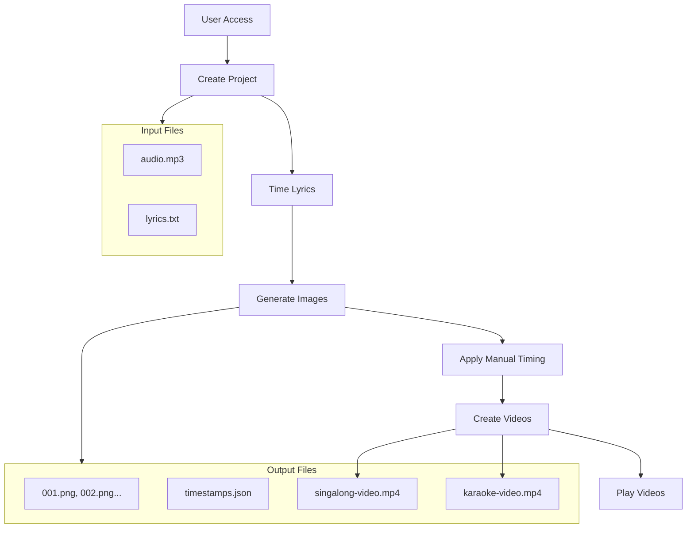
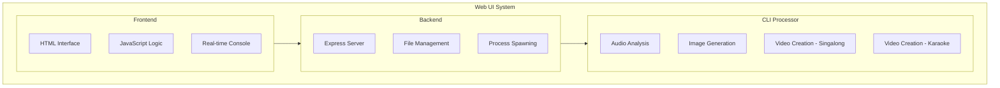
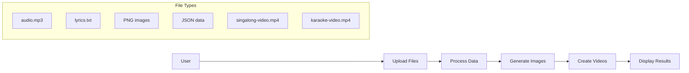
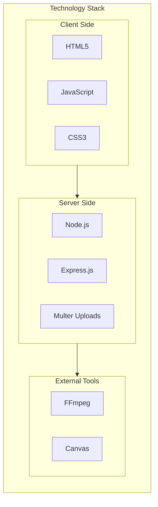

# 🌐 Web UI Architecture - Simple Overview

## Current Web UI Workflow

```mermaid
flowchart TD
    A[User Access] --> B[Create Project]
    B --> C[Time Lyrics]
    C --> D[Generate Images]
    D --> E[Apply Manual Timing]
    E --> F[Create Videos]
    F --> G[Play Videos]
    
    subgraph Inputs[Input Files]
        I1[audio.mp3]
        I2[lyrics.txt]
    end
    
    subgraph Outputs[Output Files]
        O1[001.png, 002.png...]
        O2[timestamps.json]
        O3[singalong-video.mp4]
        O4[karaoke-video.mp4]
    end
    
    B --> Inputs
    D --> Outputs
    F --> O3
    F --> O4
```

## Core Components

```mermaid
graph TB
    subgraph WebUI[Web UI System]
        Frontend[Frontend] --> Backend[Backend]
        Backend --> Processor[CLI Processor]
        
        subgraph Frontend[Frontend]
            F1[HTML Interface]
            F2[JavaScript Logic]
            F3[Real-time Console]
        end
        
        subgraph Backend[Backend]
            B1[Express Server]
            B2[File Management]
            B3[Process Spawning]
        end
        
        subgraph Processor[CLI Processor]
            P1[Audio Analysis]
            P2[Image Generation]
            P3[Video Creation - Singalong]
            P4[Video Creation - Karaoke]
        end
    end
```

## Data Flow

```mermaid
graph LR
    User[User] --> Upload[Upload Files]
    Upload --> Process[Process Data]
    Process --> Images[Generate Images]
    Images --> Videos[Create Videos]
    Videos --> Display[Display Results]
    
    subgraph Files[File Types]
        F1[audio.mp3]
        F2[lyrics.txt]
        F3[PNG images]
        F4[JSON data]
        F5[singalong-video.mp4]
        F6[karaoke-video.mp4]
    end
```

## Technology Stack

```mermaid
graph LR
    subgraph Stack[Technology Stack]
        Client[Client Side] --> Server[Server Side]
        Server --> External[External Tools]
        
        subgraph Client[Client Side]
            C1[HTML5]
            C2[JavaScript]
            C3[CSS3]
        end
        
        subgraph Server[Server Side]
            S1[Node.js]
            S2[Express.js]
            S3[Multer Uploads]
        end
        
        subgraph External[External Tools]
            E1[FFmpeg]
            E2[Canvas]
        end
    end
```
