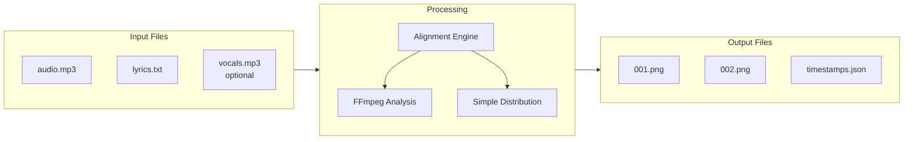
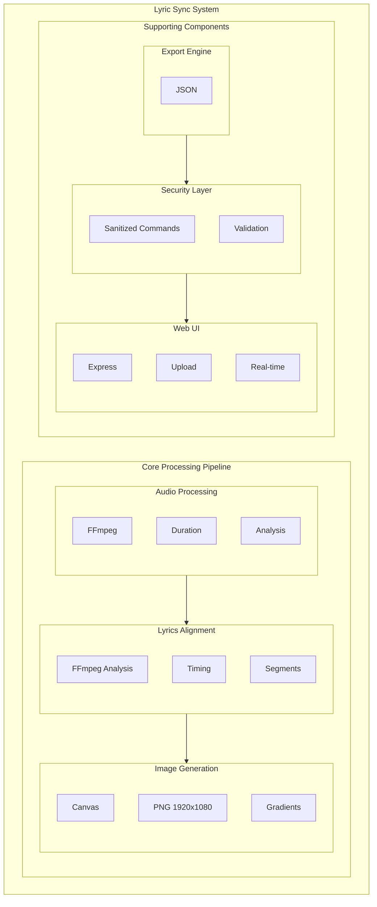
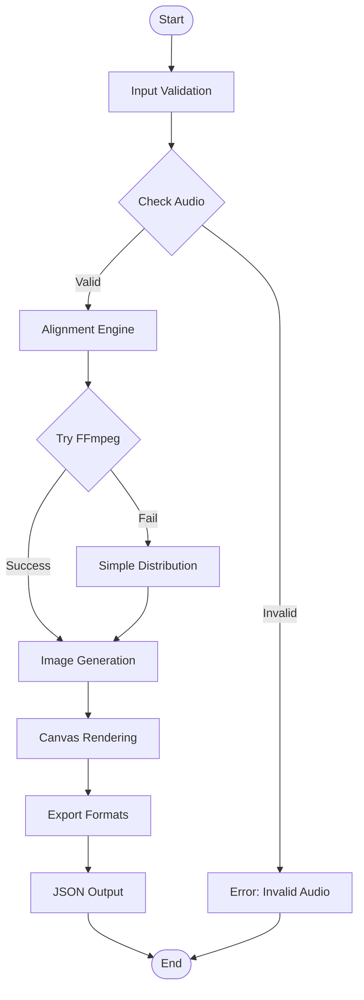
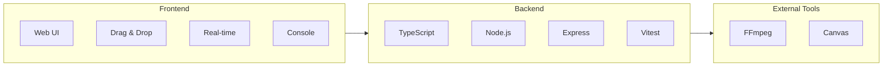
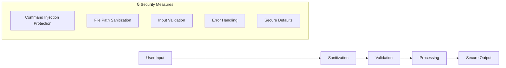
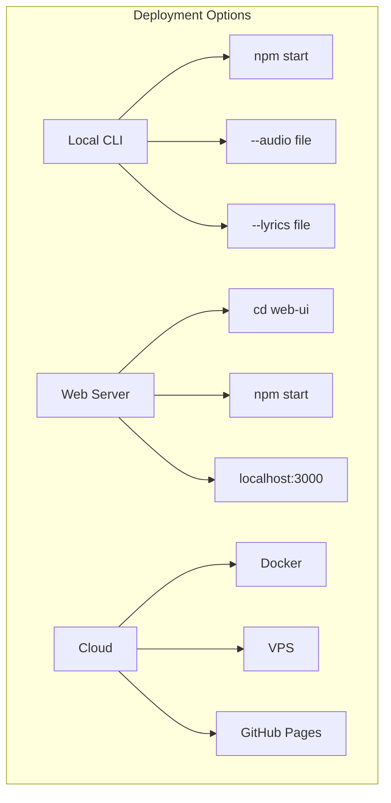
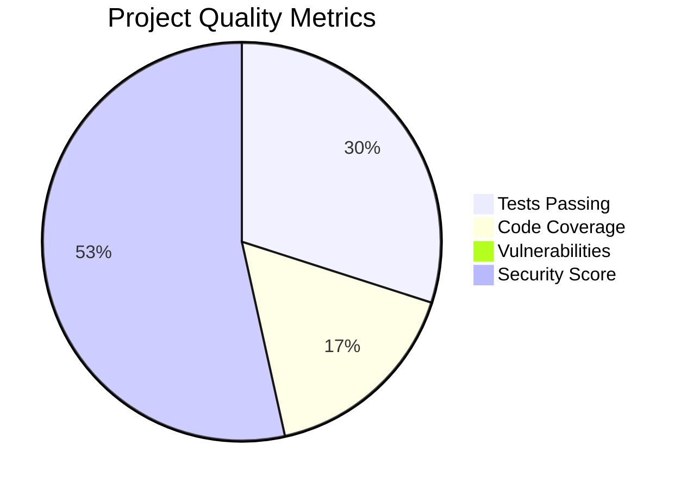
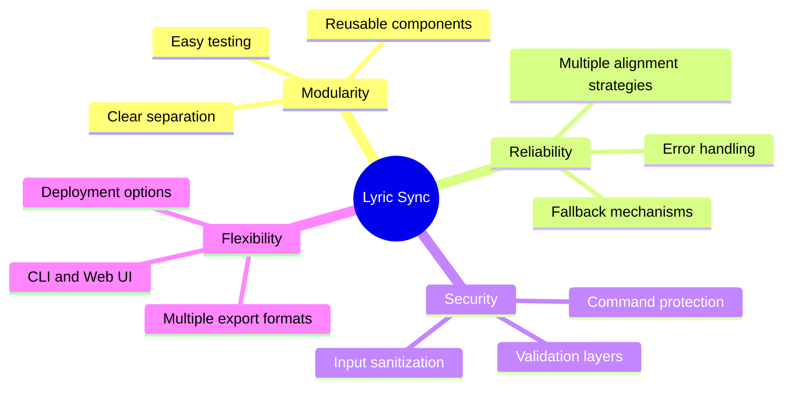

# 🏗️ Lyric Sync Architecture

## System Overview

## Core Components

## Data Flow

## Technology Stack

## Security Architecture

## Deployment Options

## Project Statistics

## Architecture Benefits

